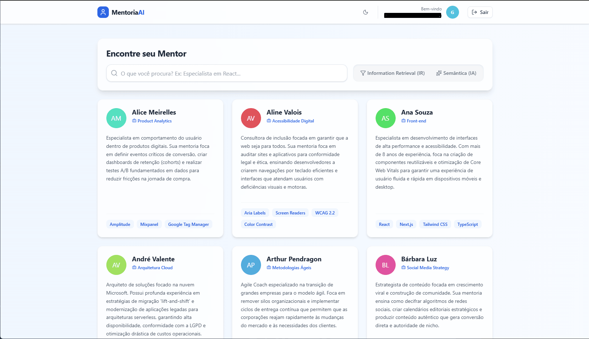
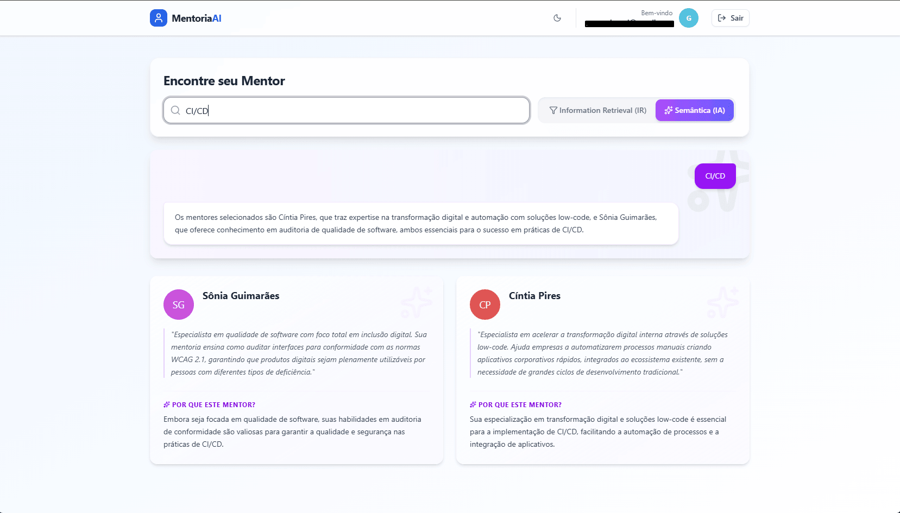
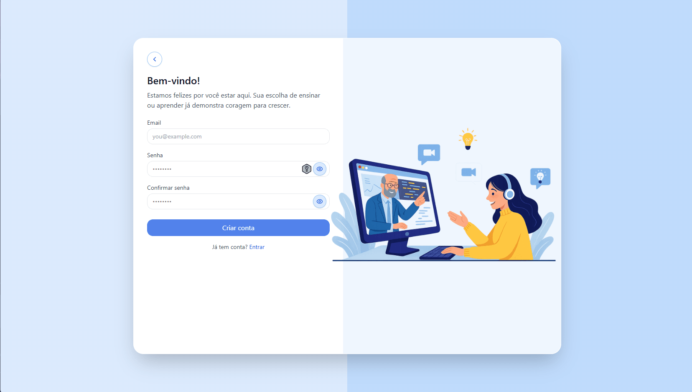

# 🧠 MentoriaAI

MentoriaAI is an AI-powered mentoring platform designed to connect users with the most suitable mentors based on their goals, skills, and learning needs.

The platform leverages **Retrieval-Augmented Generation (RAG)** and Large Language Models (LLMs) to analyze user profiles and provide personalized mentor recommendations. Built on a **microservices architecture**, the system is designed for scalability, maintainability, and independent service deployment.

## 🚀 Features

* AI-powered mentor recommendations
* Goal and skill-based matching
* Context-aware recommendations using RAG
* Scalable microservices architecture

## 🏗️ Architecture

The platform is composed of multiple independent services communicating asynchronously through message queues.

* Microservices Architecture
* Event-driven communication with RabbitMQ
* Containerized services using Docker
* PostgreSQL databases
* AI-powered recommendation engine

## 🛠️ Tech Stack

* .NET
* React
* PostgreSQL
* Docker
* RabbitMQ
* Microservices
* OpenAI API
* RAG (Retrieval-Augmented Generation)

## 📸 Screenshots

### Mentors

### Mentor Recommendation RAG (Retrieval-Augmented Generation)

### Authentication Page

## 🎯 Project Goal

The goal of MentoriaAI is to make mentorship more accessible and effective by using artificial intelligence to connect users with mentors who best match their objectives, experience level, and learning journey.
